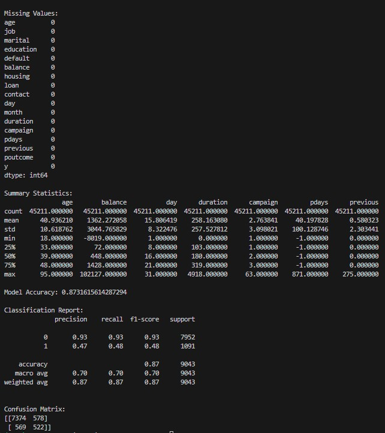
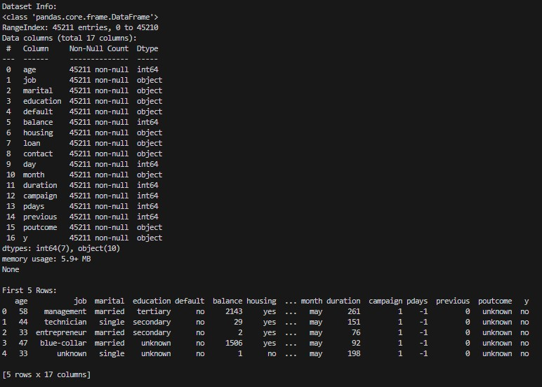
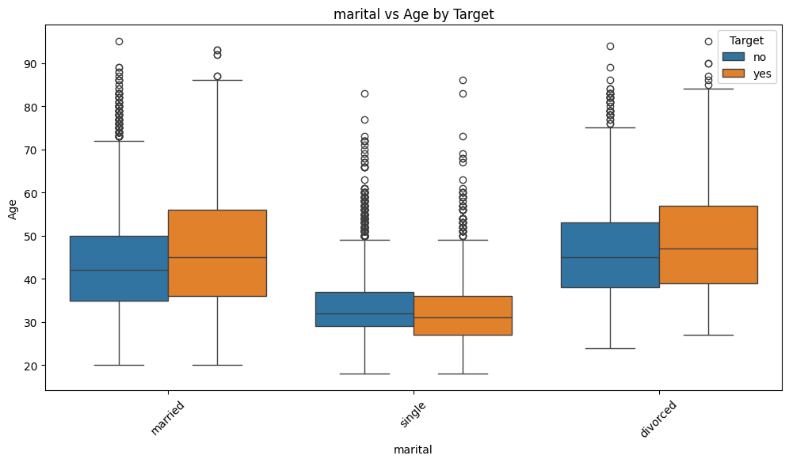
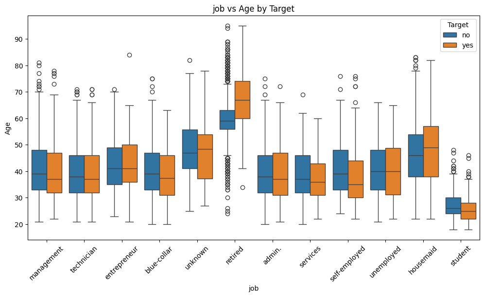
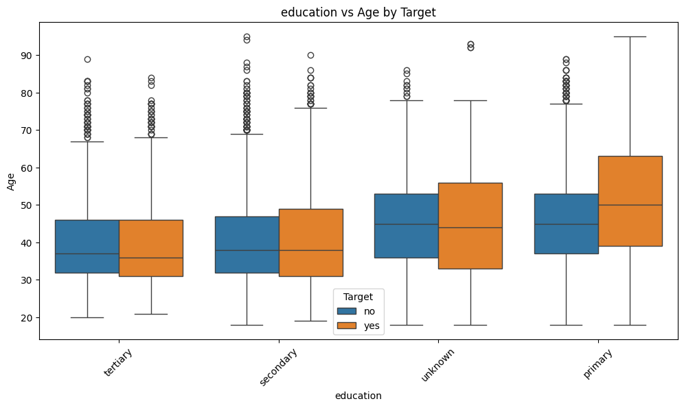
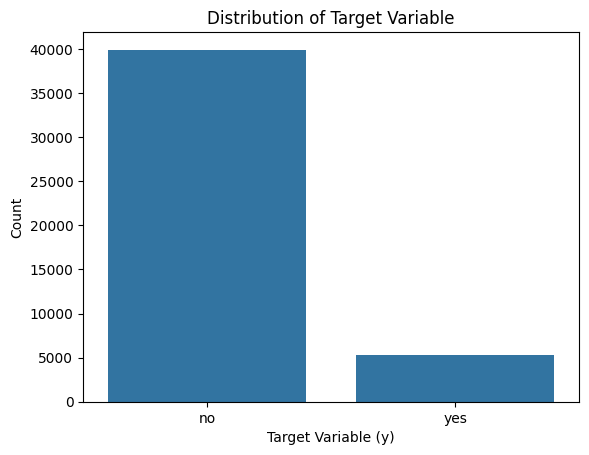
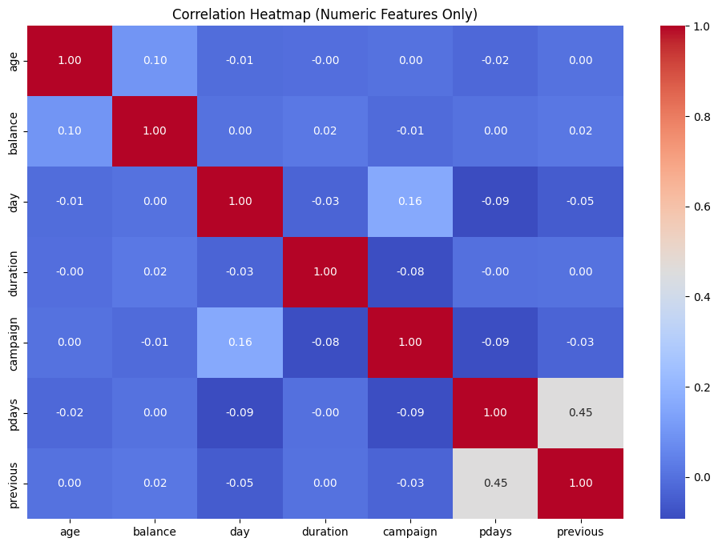
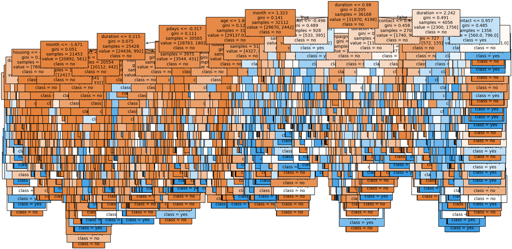

# Decision Tree Classifier for Predicting Customer Purchases

## Project Overview
This project involves building a Decision Tree Classifier to predict whether a customer will purchase a product or service based on their demographic and behavioral data. The dataset used is the Bank Marketing dataset from the UCI Machine Learning Repository.

## Features
1. **Data Analysis and Visualization:**
   - Summary statistics of the dataset.
   - Distribution of the target variable.
   - Correlation heatmap.
   - Pairplots for selected numerical features.
   - Boxplots to analyze categorical features with respect to the target.

2. **Preprocessing:**
   - Handling missing values.
   - Encoding categorical variables.
   - Standardizing features.

3. **Model Training:**
   - Using a Decision Tree Classifier to train the model.
   - Splitting the data into training and testing sets.

4. **Evaluation:**
   - Accuracy score.
   - Classification report.
   - Confusion matrix.

5. **Visualization of Decision Tree:**
   - A graphical representation of the decision tree for interpretability.

6. **Model Saving:**
   - Saves the trained model and scaler for future use.

## Dataset
The dataset used is the **Bank Marketing dataset**, which contains customer demographic and behavioral data. The target variable is `y`, indicating whether a customer purchased the product or service (`yes` or `no`).

## Installation
1. Clone the repository:
   ```bash
   git clone https://github.com/Siddhubn/SCT_DS_3/
   ```
2. Navigate to the project directory:
   ```bash
   cd SCT_DS_3
   ```
3. Run the virtual Environment:
   ```bash
   venv\Scripts\activate
   ```

## Usage
1. Place the dataset file [Dataset](bank-full.csv) in the project directory.
2. Run the Python script:
   ```bash
   python analysis.py
   ```
3. The script will output:
   - Data analysis results.
   - Model evaluation metrics.
   - Visualizations of the decision tree and dataset insights.

## File Structure
```
.
├── analysis.py  # Main Python script for building the model
├── bank-full.csv                # Dataset file (to be added manually)
├── decision_tree_model.pkl      # Saved Decision Tree model (generated after running the script)
├── scaler.pkl                   # Saved scaler object (generated after running the script)
├── README.md                    # Project documentation
```

## Results
- The decision tree achieved an accuracy of approximately 0.87.
- Insights from data visualizations help in understanding the relationships between features and the target variable.

## Screenshots:










## Future Improvements
1. Hyperparameter tuning for the Decision Tree Classifier to improve performance.
2. Incorporation of additional machine learning models for comparison.
3. Deployment of the trained model as a web service.

## License
This project is licensed under the MIT License. See the LICENSE file for details.

## Acknowledgements
- [UCI Machine Learning Repository](https://archive.ics.uci.edu/ml/index.php) for providing the Bank Marketing dataset.
- Python libraries: pandas, numpy, scikit-learn, matplotlib, seaborn.

